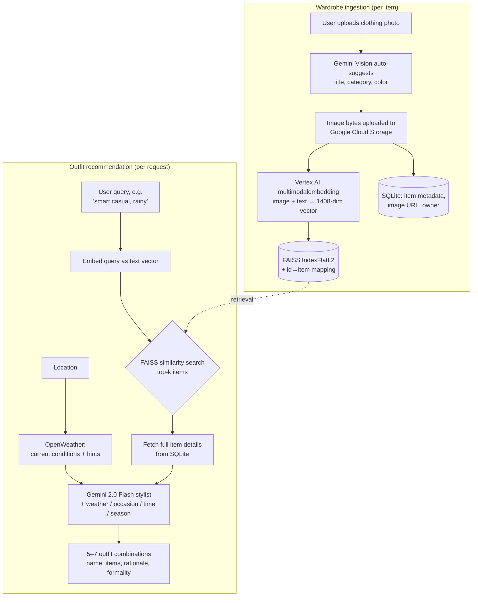

# OutfitAI

**An AI personal stylist that recommends outfits from your own wardrobe** — using multimodal image embeddings, vector similarity search, and a Gemini-powered stylist that factors in live weather, occasion, time of day, and season.

You photograph your clothes once. OutfitAI embeds each item (image + text) into a shared vector space, stores it in a FAISS index, and from then on you can ask in plain language — *"smart casual for a rainy work day"* — and get back several complete outfit combinations built **only** from clothes you actually own, each with a styling rationale and a formality rating.

<!-- SCREENSHOTS -->

---

## Why it's interesting

Most "AI outfit" demos just prompt an LLM and hope it stays grounded. OutfitAI is a proper **retrieval-augmented generation (RAG)** pipeline over a *visual* wardrobe:

- Wardrobe items are encoded with Google Vertex AI's **`multimodalembedding`** model (1408-dim), so a photo of a navy blazer and the text *"navy blazer"* land near each other in the same vector space.
- A natural-language request is embedded as text and run against the FAISS index, so retrieval is **semantic**, not keyword matching — *"something cozy for cold weather"* surfaces knitwear and coats even if the word "cozy" never appears in any item's metadata.
- Only the retrieved, relevant items are handed to the Gemini stylist. The LLM never invents garments — it can only combine items that exist in your wardrobe (it returns item **IDs**, which the backend validates against the database).

## How it works



**The two flows:**

1. **Adding an item** (`POST /me/items/`) — the image is uploaded to GCS, persisted in SQLite with metadata, and embedded via Vertex AI's multimodal model. The resulting vector is added to the FAISS index, which is written to disk after every insert so it survives restarts. A separate `POST /ai/analyze-image/` endpoint uses Gemini Vision to pre-fill the title/category/color fields from the photo.
2. **Getting a recommendation** (`POST /me/recommend-outfit`) — the request runs a three-stage RAG cycle:
   - **Retrieval** — embed the query as text, search FAISS for the top-k most similar wardrobe items.
   - **Augmentation** — load those items' full records from SQLite; optionally fetch live weather for the given location and derive time-of-day and season.
   - **Generation** — pass *only* the retrieved items + context to Gemini 2.0 Flash, which returns 5–7 outfit combinations as structured JSON (`outfit_name`, `outfit_items` as item IDs, `outfit_reason`, `formality_level`).

This is a real implementation, not a stub: the embedding model, FAISS index, persistence, GCS upload, weather integration, and JWT auth are all wired end-to-end. (It requires live Google Cloud credentials to run — there are no mocked embeddings.)

## Features

- **Multimodal wardrobe embeddings** — each item encoded from both its image and text metadata.
- **Semantic outfit search** — FAISS `IndexFlatL2` over 1408-dim vectors, persisted to disk.
- **Context-aware styling** — weather (OpenWeather), occasion, auto-detected time of day and season feed the prompt.
- **AI image analysis** — Gemini Vision auto-tags new uploads (title, category, color).
- **Wardrobe management** — CRUD for items, favorites, wear-count tracking, bulk delete, wardrobe stats.
- **Saved outfits** — persist favorite combinations.
- **JWT authentication** — bcrypt password hashing, OAuth2 bearer tokens, per-user data isolation enforced on every route.
- **Production touches** — structured logging, custom exception handling, Alembic migrations, CORS config.

## Tech stack

| Layer | Tech |
|-------|------|
| Backend API | FastAPI, Uvicorn, Pydantic |
| Database | SQLAlchemy + SQLite, Alembic migrations |
| Vector search | FAISS (`faiss-cpu`), NumPy |
| Embeddings | Google Vertex AI `multimodalembedding` (1408-dim) |
| Generative AI | Google Gemini 2.0 Flash (text + vision) |
| Storage | Google Cloud Storage |
| Auth | python-jose (JWT), passlib + bcrypt, OAuth2 |
| Weather | OpenWeather API |
| Frontend | React 19, Vite, Tailwind CSS, Framer Motion, Axios |

## Project structure

```
outfit-ai/
├── backend/
│   ├── app_server.py        # FastAPI app: routes, models, schemas, GCS upload
│   ├── ai_stylist.py        # Gemini outfit-generation prompt + parsing
│   ├── vector_db.py         # Vertex AI embeddings + FAISS index (RAG retrieval)
│   ├── weather_service.py   # OpenWeather + time-of-day / season helpers
│   ├── auth.py              # JWT, password hashing, current-user dependency
│   ├── logging_config.py    # structured logging
│   ├── exceptions.py        # custom exception types
│   ├── alembic/             # database migrations
│   ├── requirements.txt
│   └── env.example          # backend env template
└── frontend/
    └── outfit-ai-web/       # React + Vite SPA
        └── src/components/  # Login, AddItemForm, WardrobeGallery,
                             # OutfitRecommender, SavedOutfits
```

## Local setup

### Prerequisites

- Python 3.11+ and Node 18+
- A **Google Cloud project** with Vertex AI and Cloud Storage enabled, plus a service-account key (JSON)
- API keys: **Gemini** (Google AI Studio) and **OpenWeather**

### Backend

```bash
cd backend
python -m venv venv
source venv/bin/activate          # Windows: venv\Scripts\activate
pip install -r requirements.txt

cp env.example .env               # then fill in your real values
# Point GOOGLE_APPLICATION_CREDENTIALS at your GCS service-account JSON.
# Never commit that key file — it is gitignored.

alembic upgrade head              # create the database schema
uvicorn app_server:app --reload   # http://127.0.0.1:8000  (docs at /docs)
```

> **Python 3.12 note:** the pinned `faiss-cpu==1.7.4` has no 3.12 wheel — use Python 3.11, or bump `faiss-cpu` to a 3.12-compatible release. Older Google Cloud libraries also need `setuptools<81` (which still ships `pkg_resources`).

Required environment variables (see `backend/env.example`):

| Variable | Purpose |
|----------|---------|
| `GEMINI_API_KEY` | Gemini text + vision |
| `GCP_PROJECT_ID`, `GCP_LOCATION` | Vertex AI multimodal embeddings |
| `GCS_BUCKET_NAME`, `GOOGLE_APPLICATION_CREDENTIALS` | image uploads |
| `OPENWEATHER_API_KEY` | weather-aware suggestions |
| `JWT_SECRET_KEY` | sign auth tokens (use a strong random value) |
| `DATABASE_URL`, `CORS_ORIGINS`, `VECTOR_DB_DIR` | DB, CORS, FAISS index location |

### Frontend

```bash
cd frontend/outfit-ai-web
npm install
npm run dev                        # http://localhost:5173
```

The frontend expects the backend at `http://127.0.0.1:8000` (see `src/App.jsx`).

## API overview

Interactive docs are served at `/docs` when the backend is running.

| Method | Endpoint | Description |
|--------|----------|-------------|
| `POST` | `/token` | Log in, get a JWT |
| `POST` | `/users/` | Register |
| `GET`  | `/me/items/` | List the current user's wardrobe (with filters) |
| `POST` | `/me/items/` | Add an item (image upload → GCS + embedding) |
| `POST` | `/ai/analyze-image/` | Gemini Vision auto-tags an uploaded photo |
| `POST` | `/me/recommend-outfit` | RAG outfit recommendations |
| `POST` | `/me/save-outfit` | Save an outfit |
| `GET`  | `/me/saved-outfits` | List saved outfits |
| `GET`  | `/users/{id}/wardrobe-stats` | Wardrobe statistics |

See `backend/API_DOCUMENTATION.md` for the full route list.

## License

No license file is included yet — add one (e.g. MIT) before relying on this in other projects.
